# 股票智能分析系统 (Daily Stock Analysis)

> 更新时间：2026-03-13 08:00:00

## 项目愿景

基于 AI 大模型的 A股/港股/美股自选股智能分析系统，每日自动分析并推送「决策仪表盘」到企业微信/飞书/Telegram/邮箱。支持 Agent 策略问股、多数据源实时行情、自动化回测等功能。

## 架构总览

```mermaid
graph TD
    A["(根) Daily Stock Analysis"] --> B["api - FastAPI 后端"];
    A --> C["src - 核心业务逻辑"];
    A --> D["data_provider - 数据源"];
    A --> E["bot - 机器人平台"];
    A --> F["apps - 桌面/Web应用"];
    A --> G["strategies - Agent策略"];
    A --> H["scripts - 构建脚本"];
    A --> I["tests - 测试"];
    A --> J["docs - 文档"];
    A --> K["docker - 容器化"];
    A --> L[".github - CI/CD"];
    A --> M["patch - 数据源补丁"];

    C --> C1["core - 核心引擎"];
    C --> C2["agent - AI Agent"];
    C --> C3["services - 业务服务"];
    C --> C4["notification - 通知服务"];

    D --> D1["akshare_fetcher"];
    D --> D2["tushare_fetcher"];
    D --> D3["yfinance_fetcher"];
    D --> D4["efinance_fetcher"];

    E --> E1["telegram"];
    E --> E2["discord"];
    E --> E3["feishu"];
    E --> E4["dingtalk"];

    click B "./api/CLAUDE.md" "查看 API 模块文档"
    click C "./src/CLAUDE.md" "查看核心业务模块文档"
    click D "./data_provider/CLAUDE.md" "查看数据源模块文档"
    click E "./bot/CLAUDE.md" "查看机器人平台模块文档"
    click F "./apps/CLAUDE.md" "查看应用模块文档"
    click G "./strategies/CLAUDE.md" "查看策略模块文档"
    click H "#scripts-构建脚本" "查看构建脚本"
    click I "#tests-测试" "查看测试详情"
    click J "#docs-文档" "查看文档目录"
    click K "#docker-容器化" "查看 Docker 配置"
    click L "#github-cicd-workflow" "查看 CI/CD 工作流"
```



## 模块索引

| 模块 | 路径 | 职责 | 主要语言/技术 |
|------|------|------|---------------|
| **API 后端** | `api/` | FastAPI Web 服务，提供 REST API 接口 | Python, FastAPI |
| **核心业务** | `src/` | 股票分析、Agent、通知、存储等核心逻辑 | Python |
| **数据源** | `data_provider/` | 多数据源行情获取（Akshare/Tushare/腾讯等） | Python |
| **机器人** | `bot/` | 多平台机器人集成（钉钉/飞书/Telegram/Discord） | Python |
| **前端应用** | `apps/` | Web 管理界面与桌面客户端 | TypeScript, React, Electron |
| **Agent 策略** | `strategies/` | 11 种内置交易策略定义 | YAML, Python |
| **构建脚本** | `scripts/` | 跨平台构建脚本 | Shell, PowerShell |
| **测试** | `tests/` | 单元测试与集成测试 | Python, pytest |
| **文档** | `docs/` | 部署指南、FAQ、变更日志 | Markdown |
| **Docker** | `docker/` | 容器化配置 | YAML, Dockerfile |
| **CI/CD** | `.github/` | GitHub Actions 工作流 | YAML |
| **补丁** | `patch/` | 数据源授权补丁 | Python |

## 根目录关键文件

| 文件 | 说明 |
|------|------|
| `main.py` | 项目主入口，支持命令行模式 |
| `server.py` | FastAPI 服务入口 |
| `analyzer_service.py` | 独立分析服务模块 |
| `pyproject.toml` | Python 项目配置（Black, isort, Bandit） |
| `requirements.txt` | Python 依赖列表 |
| `.env.example` | 环境变量配置模板 |
| `SKILL.md` | AI 技能定义文档 |
| `AGENTS.md` | Agent 配置文档 |
| `litellm_config.example.yaml` | LiteLLM 路由配置模板 |

## 运行与开发

### 环境要求
- Python 3.10+
- Node.js 18+ (用于前端构建)

### 快速启动

```bash
# 安装依赖
pip install -r requirements.txt

# 配置环境变量
cp .env.example .env && vim .env

# 运行分析
python main.py

# 启动 Web 服务
python main.py --serve

# 启动 Web 管理界面
python main.py --webui
```

### 主要命令行参数

| 参数 | 说明 |
|------|------|
| `--debug` | 调试模式 |
| `--dry-run` | 仅获取数据不分析 |
| `--stocks 600519,000001` | 指定分析股票 |
| `--no-notify` | 不发送推送通知 |
| `--single-notify` | 单股推送模式 |
| `--market-review` | 仅运行大盘复盘 |
| `--force-run` | 跳过交易日检查 |
| `--backtest` | 运行回测 |
| `--webui` | 启动 Web 管理界面 |
| `--serve` | 启动 FastAPI 服务 |

### 启动方式

- `python main.py` - 正常运行
- `python main.py --webui` - 启动 Web 界面 + 执行定时分析
- `python main.py --webui-only` - 仅启动 Web 界面
- `python main.py --serve` - 启动 FastAPI 后端服务
- `python main.py --serve-only` - 仅启动 FastAPI 服务

## Scripts 构建脚本

### 跨平台构建脚本

| 脚本 | 平台 | 用途 |
|------|------|------|
| `scripts/build-all-macos.sh` | macOS | 构建所有组件 |
| `scripts/build-backend-macos.sh` | macOS | 仅构建后端 |
| `scripts/build-desktop-macos.sh` | macOS | 仅构建桌面客户端 |
| `scripts/build-all.ps1` | Windows | 构建所有组件 |
| `scripts/build-backend.ps1` | Windows | 仅构建后端 |
| `scripts/build-desktop.ps1` | Windows | 仅构建桌面客户端 |
| `scripts/ci_gate.sh` | macOS/Linux | 本地门禁检查 |
| `scripts/run-desktop.ps1` | Windows | 运行桌面客户端 |

### 使用示例

```bash
# macOS 构建
./scripts/build-all-macos.sh

# Windows 构建
powershell -File scripts/build-all.ps1

# 运行本地门禁
./scripts/ci_gate.sh
```

## Tests 测试

### 测试目录结构

```
tests/
├── __init__.py
├── test_agent_executor.py       # Agent 执行器测试
├── test_agent_pipeline.py       # Agent 流水线测试
├── test_agent_registry.py       # Agent 注册表测试
├── test_analysis_history.py     # 分析历史测试
├── test_auth.py                 # 认证模块测试
├── test_auth_api.py             # 认证 API 测试
├── test_backtest_engine.py      # 回测引擎测试
├── test_backtest_service.py     # 回测服务测试
├── test_backtest_summary.py     # 回测摘要测试
├── test_config_validate_structured.py  # 配置验证测试
├── test_formatters.py           # 格式化工具测试
├── test_get_latest_data.py      # 最新数据获取测试
├── test_market_analyzer_generate_text.py  # 市场分析器测试
├── test_market_strategy.py      # 市场策略测试
├── test_news_intel.py          # 新闻情报测试
├── test_notification.py         # 通知服务测试
├── test_notification_sender.py  # 通知发送器测试
├── test_pipeline_realtime_indicators.py  # 实时指标测试
├── test_search_news_freshness.py # 新闻新鲜度测试
├── test_stock_analyzer_bias.py  # 股票偏差分析测试
├── test_storage.py              # 存储服务测试
├── test_system_config_api.py    # 系统配置 API 测试
├── test_system_config_service.py # 系统配置服务测试
├── test_us_index_mapping.py    # 美股指数映射测试
├── test_yfinance_us_indices.py # Yahoo Finance 美股指数测试
├── litellm_stub.py             # LiteLLM 测试桩
├── test_data_fetcher_prefetch_stock_names.py  # 数据获取预取测试
├── test_pipeline_notification_image_routing.py # 通知图片路由测试
├── test_pipeline_prefetch_dry_run.py  # 流水线预取测试
├── test_stock_code_bse.py      # 北交所股票代码测试
├── test_akshare_realtime_logging.py   # AkShare 实时行情日志测试
├── test_fetcher_logging.py     # 数据获取器日志测试
├── test_image_stock_extractor_litellm.py # 图片提取 LiteLLM 测试
├── test_import_parser.py       # 导入解析器测试
├── test_llm_usage.py           # LLM 使用统计测试
├── test_name_to_code_resolver.py # 名称→代码解析测试
├── test_report_integrity.py    # 报告完整性测试
├── test_report_renderer.py     # 报告渲染器测试
├── test_report_schema.py       # 报告 Schema 测试
├── test_stock_code_utils.py    # 股票代码工具测试
├── test_chip_structure_fallback.py  # 筹码结构兜底测试
├── test_search_searxng.py      # SearXNG 搜索测试
├── test_agent_models_api.py    # Agent 模型 API 测试
├── test_config_manager.py      # 配置管理器测试
└── test_stooq_fallback.py      # Stooq 回退测试
```

### 运行测试

```bash
# 运行所有测试
pytest tests/ -v

# 运行特定测试
pytest tests/test_analyzer.py -v

# 带覆盖率
pytest tests/ --cov=src --cov-report=html

# 运行单个测试文件
pytest tests/test_notification.py -v

# 运行带标记的测试
pytest tests/ -v -m "not slow"
```

## Docs 文档

### 文档列表

| 文档 | 说明 |
|------|------|
| `CHANGELOG.md` | 版本变更日志 |
| `CONTRIBUTING.md` | 贡献指南 |
| `DEPLOY.md` | 部署指南（中文） |
| `DEPLOY_EN.md` | 部署指南（英文） |
| `FAQ.md` | 常见问题（中文） |
| `FAQ_EN.md` | 常见问题（英文） |
| `README_CHT.md` | 繁体中文 README |
| `README_EN.md` | 英文 README |
| `LLM_CONFIG_GUIDE.md` | LLM 配置指南（中文） |
| `LLM_CONFIG_GUIDE_EN.md` | LLM 配置指南（英文） |
| `image-extract-prompt.md` | 图片提取 Prompt 文档 |
| `bot-command.md` | 机器人命令参考 |
| `desktop-package.md` | 桌面端打包指南 |
| `full-guide.md` | 完整使用指南（中文） |
| `full-guide_EN.md` | 完整使用指南（英文） |

### Bot 配置文档

| 文档 | 说明 |
|------|------|
| `bot/dingding-bot-config.md` | 钉钉机器人配置 |
| `bot/discord-bot-config.md` | Discord 机器人配置 |
| `bot/feishu-bot-config.md` | 飞书机器人配置 |

### 部署文档

| 文档 | 说明 |
|------|------|
| `docker/zeabur-deployment.md` | Zeabur 平台部署 |

## Docker 容器化

### Docker 配置

| 文件 | 用途 |
|------|------|
| `docker/docker-compose.yml` | Docker Compose 编排配置 |

### 部署方式

```bash
# 使用 Docker Compose 启动
cd docker
docker-compose up -d
```

## GitHub CI/CD Workflow

### 工作流列表

| 工作流 | 触发条件 | 用途 |
|--------|----------|------|
| `ci.yml` | PR/push | 持续集成测试 |
| `daily_analysis.yml` | 定时每日 8:00 | 每日自动分析 |
| `desktop-release.yml` | Release | 桌面客户端发布 |
| `docker-publish.yml` | push | Docker 镜像构建发布 |
| `create-release.yml` | tag | 从 tag 注释自动创建 Release |
| `ghcr-dockerhub.yml` | push | 多平台 Docker 镜像 |
| `network-smoke.yml` | 定时 | 网络连通性测试 |
| `pr-review.yml` | PR | AI 代码审查 |
| `auto-tag.yml` | push | 自动版本标签 |
| `stale.yml` | 定时 | 标记陈旧 Issue/PR |

### 其他 GitHub 配置

| 文件 | 用途 |
|------|------|
| `.github/CODEOWNERS` | 代码所有者配置 |
| `.github/FUNDING.yml` | 赞助配置 |
| `.github/release.yml` | Release 发布配置 |
| `.github/ISSUE_TEMPLATE/` | Issue 模板 |
| `.github/PULL_REQUEST_TEMPLATE.md` | PR 模板 |
| `.github/scripts/ai_review.py` | AI 代码审查脚本 |

## Patch 数据源补丁

### 东方财富补丁

| 文件 | 说明 |
|------|------|
| `patch/eastmoney_patch.py` | 东方财富数据接口授权补丁 |

### 功能说明

`eastmoney_patch.py` 模块用于解决东方财富数据接口的授权验证问题：
- 自动获取 NID 授权令牌
- 实现缓存机制避免频繁请求
- 随机 User-Agent 模拟浏览器访问
- 请求间隔防封禁机制

### 使用方式

```python
from patch.eastmoney_patch import eastmoney_patch

# 在数据获取前调用补丁
eastmoney_patch()
```

## 编码规范

### Python 代码规范
- 使用 Black 格式化：`black .`（行长 120）
- 使用 isort 排序导入
- 使用 Bandit 进行安全检查
- 类型注解：优先使用类型注解

### 配置约束 (pyproject.toml)
- 目标 Python 版本：3.10, 3.11, 3.12
- 行长限制：120
- 排除目录：.git, __pycache__, venv, build, dist

### 本地门禁

```bash
pip install flake8 pytest
./scripts/ci_gate.sh
```

## AI 使用指引

### 🚀 开发新功能规则（CRITICAL）

**开发新功能必须使用 Superpowers 的 subagent-driven-development 技能**

本项目已安装 Superpowers 插件，所有新功能开发必须遵循以下流程：

#### 1. 触发 Superpowers 技能

直接描述需求，Superpowers 会自动引导整个开发流程：

```
我想开发一个新功能：[功能描述]
```

Superpowers 会自动触发以下技能：
- **brainstorming** - 设计阶段
- **writing-plans** - 计划阶段
- **subagent-driven-development** - 开发阶段（核心）
- **test-driven-development** - 测试阶段
- **requesting-code-review** - 代码审查阶段

#### 2. Subagent-Driven-Development 流程

- 每个任务由独立的子代理完成
- 两阶段审查：规格符合性 → 代码质量
- 并行处理多个任务
- 自动验证和代码审查

#### 3. 禁止直接编码

❌ **禁止直接编写代码** - 必须通过 Superpowers 工作流
❌ **禁止直接使用 Task 工具** - Superpowers 会自动调用子代理
✅ **必须通过 Superpowers 技能** - 确保代码质量和可维护性

#### 4. 例外情况

只有以下情况可以不使用 Superpowers：
- **紧急 Bug 修复**：单个方法的简单修复
- **文档更新**：README、CHANGELOG 等非代码修改
- **配置调整**：环境变量、配置文件修改

### 项目特点
1. **多数据源**：支持 AkShare、Tushare、腾讯财经、Yahoo Finance 等
2. **多通知渠道**：企业微信、飞书、Telegram、Discord、邮件等
3. **AI Agent**：支持策略问答，可扩展 11 种内置策略
4. **实时行情**：支持盘中实时 MA/多头排列计算
5. **回测系统**：自动评估历史分析准确率
6. **多渠道 LLM**：支持 LiteLLM 统一配置多模型供应商

### 核心流程
1. **数据获取**：`DataFetcherManager` 统一管理多数据源
2. **趋势分析**：`StockTrendAnalyzer` 计算 MA/多头排列
3. **AI 分析**：`GeminiAnalyzer` 生成决策建议
4. **通知发送**：`NotificationService` 多渠道推送

### 常见任务
- 添加新数据源：继承 `data_provider/base.py` 中的 `BaseFetcher`
- 添加新通知渠道：继承 `src/notification_sender/` 中的基类
- 添加新 Agent 策略：在 `strategies/` 目录下创建 YAML 文件
- 添加新 API 端点：在 `api/v1/endpoints/` 下创建文件
- 配置 LLM 渠道：使用 Web 界面的 LLMChannelEditor 组件或 litellm_config.yaml

## 变更记录

### 2026-03-16 14:20:00 - 同步 upstream v3.7.0
- **💼 持仓管理 P0 全功能上线**（#677，对应 Issue #627）
  - 核心账本与快照闭环：账户、交易、现金流水、企业行为、持仓缓存、每日快照
  - 券商 CSV 导入：华泰/中信/招商首批适配，支持两阶段接口和幂等去重
  - 组合风险报告：集中度风险、历史回撤监控、止损接近预警
  - Web 持仓页（`/portfolio`）：组合总览、持仓明细、风险摘要
  - Agent 持仓工具：`get_portfolio_snapshot` 数据工具
- **🎨 前端设计系统与原子组件库**（#662）
  - 渐进式双主题架构（HSL 变量化设计令牌）
  - 重构 20+ 核心组件（Button/Card/Badge/Input/Select 等）
  - 新增 `clsx` + `tailwind-merge` 类名合并工具
- **⚡ 分析 API 异步契约与启动优化**（#656）
  - 规范异步请求返回契约
  - 修复前端报告类型联合定义
- **🔔 Discord 环境变量向后兼容**（#659）
- **🔧 GitHub Actions Node 24 升级**（#665）
- **📊 新增测试文件**: 多个持仓、API、Agent 相关测试
- **新增模块**:
  - `src/repositories/portfolio_repo.py` - 持仓数据仓库
  - `src/services/portfolio_service.py` - 持仓服务
  - `src/services/portfolio_import_service.py` - CSV 导入服务
  - `src/services/portfolio_risk_service.py` - 风险分析服务
  - `data_provider/fundamental_adapter.py` - 基本面数据适配器
  - `api/v1/endpoints/portfolio.py` - 持仓 API 端点
  - `api/v1/schemas/portfolio.py` - 持仓 Schema
  - `apps/dsa-web/src/pages/PortfolioPage.tsx` - 持仓管理页面
  - `src/agent/orchestrator.py` - 多智能体协调器
  - `src/agent/runner.py` - Agent 运行器
  - `src/agent/agents/` - 专业 Agent 基类和实现
  - `src/agent/strategies/` - 策略系统
- **文档新增**: `docs/openclaw-skill-integration.md`

### 2026-03-14 - 同步 upstream v3.6.0
- **📊 Web UI Design System** — 实现双主题架构和终端风格原子 UI 组件
- **🗑️ 历史批量删除** — Web UI 支持多选和批量删除分析历史
- **🔐 Auth settings API** — 运行时启用/禁用 Web 认证
- **⚙️ LLM channel protocol/test UX** — 统一渠道配置和连接测试
- **🤖 Agent architecture Phase 0-7** — 多智能体架构完整实现
  - `AgentOrchestrator` 四模式协调器
  - `BaseAgent` 专业 Agent 基类
  - 5 种专业 Agent：Technical/Intel/Decision/Risk/Portfolio
  - 策略系统和聚合器
  - Memory 和校准系统
- **🔍 Bot NL routing** — 自然语言路由和 `/ask` 多股分析
- **📋 `/history` 和 `/strategies` 命令**
- **🔬 Deep Research agent** — 三阶段深度研究 Agent
- **🧠 Agent Memory** — 预测准确度跟踪和置信度校准
- **📊 Portfolio Agent** — 多股票投资组合分析
- **🔔 Event-driven alerts** — 价格/成交量/情绪事件监控
- **新增文档**: openclaw-skill-integration.md

### 2026-03-13 08:00:00 - 同步 upstream v3.5.0
- **配置引擎重构 (#602)**: 统一配置注册表、验证和 API 暴露
- **数据源韧性增强**: 回退链优化，YFinance 获取器大幅增强（Stooq 回退、美股支持）
- **Agent 模型发现 API**: `GET /api/v1/agent/models` 返回可用模型部署
- **Web UI 完整报告**: 历史页面新增「完整报告」按钮，侧边抽屉显示 Markdown
- **analyze_trend 修复 (#600)**: 从 DB/DataFetcher 获取数据，不再报告无历史数据
- **Stooq 美股昨收语义修复**: 不再错误使用开盘价作为昨收
- **股票名称预取修复**: 优先使用本地 `STOCK_NAME_MAP`
- **.env 保存优化**: Web 设置不再破坏注释和空行格式
- **新增服务**: `src/services/agent_model_service.py`
- **新增测试**: 3 个新测试文件（agent_models_api, config_manager, stooq_fallback）

### 2026-03-12 10:00:00 - 同步 upstream (latest)
- **SearXNG 搜索支持**: 新增配额免费的搜索提供者，优先级最低作为兜底选项
- **GitHub Actions LiteLLM 配置**: 工作流支持 `litellm_config.yaml` 文件提交或 Variables/Secret 方式配置
- **筹码结构兜底补全**: DeepSeek 等模型未填写 `chip_structure` 时自动用数据源数据补全
- **MiniMax 搜索状态**: `/status` 命令新增 MiniMax 搜索状态显示
- **LLM 配置指南重构**: 更清晰易读的文档结构
- **搜索服务增强**: `src/search_service.py` 大幅扩展，新增 SearXNG 支持
- **飞书通知简化**: 删除过时的 `feishu_notification_fix.md` 文档
- **测试增强**: 新增 2 个测试文件（chip_structure_fallback, search_searxng）

### 2026-03-10 12:00:00 - 同步 upstream v3.4.11
- **报告引擎 P0**: Pydantic schema 验证、Jinja2 模板渲染、内容完整性校验
- **智能导入 (P1)**: 支持图片、CSV/Excel、剪贴板多源导入，Vision LLM 提取代码+名称+置信度
- **Agent 问股增强**: 导出会话（.md）、发送到通知渠道、后台执行（切换页面不中断）
- **LLM Token 跟踪**: 所有 LLM 调用记录在 `llm_usage` 表，新增 `GET /api/v1/usage/summary` API
- **LLM 配置指南**: 新增 `docs/LLM_CONFIG_GUIDE.md`，系统讲解三层配置、快速上手、Vision/Agent/Web UI/校验排错
- **MiniMax 搜索提供者**: 新增 `MiniMaxSearchProvider`，支持熔断机制和双重时间过滤
- **历史报告修复**: 狙击点位显示原始文本，避免数值列压缩
- **数据源增强**: AkShare 市场分析涨跌停计算修复、efinance ETF 行情字段映射修正、pytdx 股票名称缓存分页
- **PushPlus 分块**: 修复超长报告推送问题
- **新增模块**:
  - `src/data/` - 数据模块
  - `src/schemas/` - Schema 模块（report_schema.py）
  - `src/services/import_parser.py` - 导入解析服务
  - `src/services/name_to_code_resolver.py` - 名称→代码解析
  - `src/services/history_comparison_service.py` - 历史对比服务
  - `src/services/report_renderer.py` - 报告渲染服务
  - `src/services/stock_code_utils.py` - 股票代码工具
  - `templates/` - Jinja2 报告模板（_macros.j2, report_brief.j2, report_markdown.j2, report_wechat.j2）
- **新增测试文件**: 13 个新测试文件（akshare_realtime_logging, fetcher_logging, image_stock_extractor_litellm, import_parser, llm_usage, name_to_code_resolver, report_integrity, report_renderer, report_schema, stock_code_utils, 以及增强的测试）
- **新增 API 端点**: `api/v1/endpoints/usage.py`（LLM 使用统计）
- **前端组件变更**: `ImageStockExtractor.tsx` → `IntelligentImport.tsx`（智能导入组件）
- **新增 Store**: `agentChatStore.ts`（Agent 聊天状态管理）
- **新增文档**: `docs/LLM_CONFIG_GUIDE.md`, `docs/LLM_CONFIG_GUIDE_EN.md`, `docs/image-extract-prompt.md`
- **删除文档**: `docs/feishu_notification_fix.md`

### 2026-03-08 00:15:00 - 同步 upstream v3.4.10
- **新增 GitHub 工作流**: create-release.yml（从 tag 注释自动创建 Release）
- **ETF 数据修复**: 使用 stock API 获取 ETF OHLCV 数据
- **依赖版本锁定**: tiktoken <0.12
- **错误处理增强**: 新增 ApiErrorAlert 组件和 error.ts API 模块
- **数据处理工具**: 新增 src/utils/data_processing.py 工具模块
- **测试覆盖增强**: 新增 5 个测试文件
  - litellm_stub.py（LiteLLM 测试桩）
  - test_data_fetcher_prefetch_stock_names.py（数据获取预取测试）
  - test_pipeline_notification_image_routing.py（通知图片路由测试）
  - test_pipeline_prefetch_dry_run.py（流水线预取测试）
  - test_stock_code_bse.py（北交所股票代码测试）
- **文档更新**: AGENTS.md 添加 tag/release notes 约定
- **数据提供者改进**: 多个数据源文件优化（akshare, baostock, efinance, pytdx, tushare, yfinance）
- **流水线增强**: src/core/pipeline.py 新增通知图片路由逻辑
- **配置管理**: src/config.py 新增配置项

### 2026-03-07 14:49:00 - 增量更新（合并 upstream）
- 新增 LLMChannelEditor.tsx 组件（Web 前端 LLM 渠道编辑器）
- 新增 litellm_config.example.yaml 配置示例
- 新增 test_config_validate_structured.py 测试
- 新增 test_market_analyzer_generate_text.py 测试
- 新增 src/core/config_registry.py 配置字段元数据注册表
- 更新 apps/CLAUDE.md - 添加 LLM 渠道编辑器组件说明
- 更新 src/CLAUDE.md - 添加配置注册表模块和测试说明
- 覆盖率提升至：99%

### 2026-03-05 14:35:00 - 深度补捞
- 添加 scripts/ 构建脚本模块覆盖
- 添加 tests/ 测试目录详细文件清单
- 添加 docker/ 容器化配置
- 添加 .github/ CI/CD 工作流
- 添加 patch/ 数据源补丁模块
- 添加 docs/ 文档目录覆盖
- 添加根目录关键文件说明
- 更新模块索引，新增 5 个子模块
- 更新架构总览图（Mermaid）
- 覆盖率提升至：98.5%

### 2026-03-05 - 初始化项目
- 创建 CLAUDE.md 文档
- 建立模块索引和结构图
- 识别核心模块：api, src, data_provider, bot, apps, strategies
- 覆盖率评估：约 95%（包含测试文件）

---

*提示：点击上方模块名称或 Mermaid 图表中的节点可快速跳转到对应模块的详细文档。*
